# Vacanam — Implementation Plan

> A production-quality local voice typing Windows desktop application, similar to Wispr Flow, built with .NET 10 / WPF / MVVM.

---

## Overview

Vacanam runs silently in the system tray. When the user holds a configurable global hotkey (default `Ctrl+Space`) in any Windows application, it records their voice, transcribes it locally via **whisper.cpp**, optionally refines the result through a local LLM (**llama.cpp**), and injects the final text back into the active window — all without any cloud dependency.

This plan covers the **full 10-phase roadmap** but starts with an immediately actionable **Phase 1 execution** (App Shell).

---

## User Review Required

> [!IMPORTANT]
> **Phase-by-phase gating**: Each phase ends with a working, runnable build. You must explicitly approve before the next phase begins. This plan covers all 10 phases but only Phase 1 will be executed first.

> [!WARNING]
> **.NET 10 SDK Required**: The solution targets `net10.0-windows`. Ensure the .NET 10 SDK is installed on your machine before Phase 1 execution begins. Run `dotnet --version` to verify.

> [!IMPORTANT]
> **Model files are NOT in Git**: Whisper and LLM model files are large binaries stored in `%LOCALAPPDATA%\Vacanam\Models\`. The repo contains only download scripts and model manifests.

> [!NOTE]
> **No admin privileges required**: `RegisterHotKey` does not need elevation for standard user hotkeys. The app will request elevation only if the target application is elevated (rare case documented in Phase 2).

---

## Decisions Resolved ✅

| # | Decision | Answer |
|---|---|---|
| Q1 | Default hotkey | `Ctrl+Space` ✅ confirmed |
| Q2 | Whisper model | All model sizes selectable in Settings → Speech; **`small`** is the default |
| Q3 | LLM | All three models available (Phi-3.5-mini, Llama 3.2 3B, Gemma 2 2B); **disabled by default** — user downloads and selects in Settings → AI |
| Q4 | Overlay position | **Bottom-center** of screen (always visible, non-intrusive) |
| Q5 | Transcript history | **Opt-in** — disabled by default; user enables in Settings → Privacy |

---

## Solution Architecture

### Project Structure

```
Vacanam.sln
│
src/
├── Vacanam.App/              ← WPF UI layer (Phase 1)
├── Vacanam.Core/             ← Interfaces & domain models (Phase 1)
├── Vacanam.Infrastructure/   ← DI wiring, shared services (Phase 1)
├── Vacanam.Windows/          ← Win32 P/Invoke (Phase 2)
├── Vacanam.Audio/            ← NAudio WASAPI capture (Phase 3)
├── Vacanam.Speech/           ← Whisper.net transcription (Phase 4)
├── Vacanam.LLM/              ← LLamaSharp inference (Phase 6)
├── Vacanam.Input/            ← Text injection strategies (Phase 5)
└── Vacanam.Data/             ← SQLite history (Phase 7+)
```

> [!NOTE]
> **No test projects** — test projects are excluded from the initial build. They will be added in a later phase when the core functionality is stable.

---

## Phase Roadmap

```mermaid
gantt
    title Vacanam Development Phases
    dateFormat  X
    axisFormat Phase %s

    section Shell
    Phase 1 - App Shell       :p1, 0, 1
    section Windows APIs
    Phase 2 - Global Hotkeys  :p2, 1, 2
    section Audio
    Phase 3 - Audio Capture   :p3, 2, 3
    section STT
    Phase 4 - Whisper STT     :p4, 3, 4
    section Injection
    Phase 5 - Text Injection  :p5, 4, 5
    section LLM
    Phase 6 - Local LLM       :p6, 5, 6
    section Commands
    Phase 7 - Voice Commands  :p7, 6, 7
    section Context
    Phase 8 - App Awareness   :p8, 7, 8
    section Selection
    Phase 9 - Selected Text   :p9, 8, 9
    section Polish
    Phase 10 - Optimization   :p10, 9, 10
```



---

## Phase 1 — App Shell (CURRENT EXECUTION TARGET)

### Goals
- Buildable, runnable WPF solution targeting `.NET 10`
- Application starts as a **tray-only** app (no visible window on launch)
- Structured DI container wired using `Microsoft.Extensions.DependencyInjection`
- Structured logging via `Microsoft.Extensions.Logging` + `Serilog` sink
- Settings window (skeleton with categories, no logic yet)
- Clean MVVM with `CommunityToolkit.Mvvm`
- App state machine stub (`VacanamState` enum)
- Graceful shutdown (tray → Exit cleans up and exits)

### NuGet Packages — Phase 1

| Package | Version | Project | Purpose |
|---|---|---|---|
| `CommunityToolkit.Mvvm` | 8.4+ | App, Core | MVVM source generators |
| `Microsoft.Extensions.DependencyInjection` | 10.x | App, Infrastructure | DI container |
| `Microsoft.Extensions.Logging` | 10.x | Core | Logging abstraction |
| `Microsoft.Extensions.Logging.Debug` | 10.x | App | Debug output sink |
| `Serilog` | 4.x | App | Structured logging |
| `Serilog.Extensions.Logging` | 9.x | App | Bridge to MEL |
| `Serilog.Sinks.File` | 6.x | App | File logging |
| `Hardcodet.NotifyIcon.Wpf` | 2.0.1 | App | Tray icon (maintained fork) |
| `Microsoft.Extensions.Configuration` | 10.x | Infrastructure | Config abstraction |
| `Microsoft.Extensions.Configuration.Json` | 10.x | Infrastructure | appsettings.json |
| `Microsoft.Extensions.Options` | 10.x | Infrastructure | Typed options |

### Phase 1 File Map

#### `Vacanam.Core` — Domain layer (no dependencies)
```
Vacanam.Core/
├── Enums/
│   ├── VacanamState.cs          ← State machine enum
│   └── ProcessingMode.cs        ← Fast / AI / Command
├── Models/
│   ├── ApplicationContext.cs    ← record with WindowHandle, ProcessId, etc.
│   ├── RecordingSession.cs      ← Immutable session data
│   └── AppSettings.cs           ← Typed settings model
├── Interfaces/
│   ├── IAudioRecorder.cs
│   ├── ISpeechRecognizer.cs
│   ├── ITextProcessor.cs
│   ├── ITextInjector.cs
│   ├── IGlobalHotkeyService.cs
│   ├── IForegroundWindowService.cs
│   ├── IClipboardService.cs
│   ├── IVoiceCommandProcessor.cs
│   ├── IApplicationContextProvider.cs
│   ├── IVoiceActivityDetector.cs
│   ├── IModelManager.cs
│   └── IHistoryRepository.cs
└── Exceptions/
    └── VacanamException.cs
```

#### `Vacanam.Infrastructure` — DI wiring & shared utilities
```
Vacanam.Infrastructure/
├── DependencyInjection/
│   └── ServiceCollectionExtensions.cs   ← AddVacanamCore(), AddVacanamApp()
├── Configuration/
│   └── SettingsManager.cs               ← Load/save appsettings.json
└── Stubs/
    ├── NullAudioRecorder.cs             ← [MOCK] Phase 1 placeholder
    ├── NullSpeechRecognizer.cs          ← [MOCK] Phase 1 placeholder
    ├── NullTextInjector.cs              ← [MOCK] Phase 1 placeholder
    └── NullHotkeyService.cs             ← [MOCK] Phase 1 placeholder
```

> [!NOTE]
> All stub/null implementations are clearly marked with `[MOCK]` XML doc comments and will be replaced in their respective phases.

#### `Vacanam.App` — WPF application
```
Vacanam.App/
├── App.xaml                    ← ShutdownMode=OnExplicitShutdown
├── App.xaml.cs                 ← Host startup, DI bootstrap, tray init
├── Resources/
│   ├── Styles/
│   │   ├── App.xaml            ← Global styles, color palette
│   │   ├── Controls.xaml       ← Custom control styles
│   │   └── Typography.xaml     ← Font definitions (Segoe UI Variable)
│   └── Icons/
│       ├── vacanam_tray.ico    ← 16×16, 32×32, 48×48 multi-res icon
│       └── vacanam_tray_recording.ico
├── TrayIcon/
│   ├── TrayIconControl.xaml    ← NotifyIcon XAML declaration
│   └── TrayIconControl.xaml.cs ← Minimal code-behind for HWND hook
├── ViewModels/
│   ├── MainViewModel.cs        ← App state, tray command routing
│   ├── SettingsViewModel.cs    ← Settings categories + save/cancel
│   └── RecordingOverlayViewModel.cs ← Overlay state binding
├── Views/
│   ├── SettingsWindow.xaml     ← Settings window (tabbed: General, Hotkeys, Audio, Speech, AI, Privacy)
│   ├── SettingsWindow.xaml.cs
│   ├── RecordingOverlay.xaml   ← Frameless, topmost, transparent overlay
│   └── RecordingOverlay.xaml.cs
├── Services/
│   └── ApplicationLifetimeService.cs ← Manages startup/shutdown sequencing
└── appsettings.json
```

### Key Design Decisions — Phase 1

#### Tray-Only Startup
```csharp
// App.xaml
<Application ShutdownMode="OnExplicitShutdown" ...>

// App.xaml.cs OnStartup — no MainWindow.Show()
_host = Host.CreateDefaultBuilder()
    .ConfigureServices(ConfigureServices)
    .Build();
await _host.StartAsync();
// Tray icon is initialized here, no window shown
```

#### HWND Message Hook (for Phase 2 readiness)
A hidden window is created in Phase 1 to own the HWND message pump. This window is invisible and only exists to receive `WM_HOTKEY` messages in Phase 2 without requiring a visible WPF window.

```csharp
// HotkeyMessageWindow.cs — Phase 1 creates this shell
internal sealed class HotkeyMessageWindow : Window
{
    // Invisible helper window; handle exposed for RegisterHotKey
    public IntPtr Handle { get; private set; }
}
```

#### VacanamState Machine
```csharp
public enum VacanamState
{
    Idle,
    StartingRecording,
    Recording,
    StoppingRecording,
    Transcribing,
    Processing,
    Inserting,
    Completed,
    Error
}
```

`MainViewModel` exposes `CurrentState` as an `[ObservableProperty]`, driving overlay UI in later phases.

#### Logging Configuration
- Logs to: `%LOCALAPPDATA%\Vacanam\Logs\vacanam-.log` (daily rolling)
- Console/Debug sink in `DEBUG` builds only
- **Never logs**: audio data, transcribed text, clipboard contents

---

## Phase 2 — Global Hotkeys

### Goals
- `GlobalHotkeyService` in `Vacanam.Windows` using `RegisterHotKey`
- Push-to-talk mode (hold) + Toggle mode
- `HotkeyMessageWindow` processes `WM_HOTKEY` via `HwndSource.AddHook`
- Unregisters cleanly on shutdown
- Settings: configurable modifier + key

### Key APIs
```
RegisterHotKey(hwnd, id, MOD_CONTROL, VK_SPACE)   → default Ctrl+Space
UnregisterHotKey(hwnd, id)                         → on shutdown/settings change
```

### Design Note
- No `SetWindowsHookEx` (keyboard hook) — `RegisterHotKey` is sufficient and less invasive
- `GetAsyncKeyState` used only for hold-detection polling (push-to-talk distinguish hold vs tap)
- Conflict detection: if `RegisterHotKey` returns `false`, show tray balloon notification with fallback suggestion

---

## Phase 3 — Audio Capture

### Goals
- `AudioRecorderService` in `Vacanam.Audio` using `NAudio`
- WASAPI capture with auto-convert to 16 kHz 16-bit mono PCM
- Microphone enumeration + selection
- Audio level meter (float RMS → `double` 0.0–1.0)
- Voice Activity Detection stub (energy threshold)
- Non-blocking: all callbacks off UI thread

### Key NuGet Additions
| Package | Purpose |
|---|---|
| `NAudio` | Audio capture |
| `NAudio.WaveFormRenderer` | Optional waveform display |

### Architecture
```
WasapiCapture → MediaFoundationResampler (→ 16kHz 16-bit mono) 
             → BufferedWaveProvider 
             → IAudioRecorder.DataAvailable event
             → IVoiceActivityDetector.IsSpeech()
```

---

## Phase 4 — Speech Transcription (Whisper)

### Goals
- `WhisperSpeechRecognizer` in `Vacanam.Speech` using `Whisper.net`
- Auto-detect CPU vs CUDA at startup
- Model lifecycle: lazy load, keep warm, dispose on settings change
- Support `tiny`, `base`, `small`, `medium`, `large-v3` model selection
- Streaming-ready: segment callbacks as Whisper produces them
- Model download helper via `WhisperGgmlDownloader`

### Key NuGet Additions
| Package | Purpose |
|---|---|
| `Whisper.net` | Core managed wrapper |
| `Whisper.net.Runtime` | CPU runtime binaries |
| `Whisper.net.Runtime.Cuda12` | NVIDIA GPU runtime (conditional) |

### Model Storage
```
%LOCALAPPDATA%\Vacanam\Models\Whisper\
    ggml-tiny.bin          ← ~75 MB  (fastest)
    ggml-small.bin         ← ~466 MB (DEFAULT)
    ggml-medium.bin        ← ~1.5 GB
    ggml-large-v3.bin      ← ~3.1 GB
```

### Settings → Speech
- Model dropdown: `tiny` / `small` *(default)* / `medium` / `large-v3`
- Inference device: `Auto` / `CPU` / `CUDA`
- Download button per model (shows size, progress bar)

---

## Phase 5 — Text Injection

### Goals
- `TextInjectorService` in `Vacanam.Input` with 3-strategy cascade
- Clipboard strategy: saves current clipboard → pastes text → restores clipboard
- SendInput fallback: character-by-character via `VK_` codes
- UI Automation fallback: `IUIAutomation::SetValue` for accessible controls
- Application-specific overrides (e.g., terminal apps prefer SendInput)

### Key NuGet Additions
| Package | Purpose |
|---|---|
| `UIAutomationClient` | UI Automation API |
| `UIAutomationTypes` | Type definitions |

### Text Injection Cascade
```
1. ClipboardInjector   → BackupClipboard → SetText → Ctrl+V → RestoreClipboard
2. SendInputInjector   → WM_CHAR via SendInput (no clipboard needed)
3. UiAutomationInjector → Pattern.SetValue (accessibility-safe)
```

---

## Phase 6 — Local LLM

### Goals
- `LlmTextProcessor` in `Vacanam.LLM` using `LLamaSharp`
- Grammar correction, cleanup, formatting
- Context-aware system prompts (app context from Phase 8)
- Streaming token output to overlay
- Conservative rules: never change meaning, preserve code/names/numbers
- Auto GPU-offload layer detection based on available VRAM

### Key NuGet Additions
| Package | Purpose |
|---|---|
| `LLamaSharp` | llama.cpp managed bindings |
| `LLamaSharp.Backend.Cpu` | CPU backend |
| `LLamaSharp.Backend.Cuda12` | CUDA backend (conditional) |

### Model Storage
```
%LOCALAPPDATA%\Vacanam\Models\LLM\
    phi-3.5-mini-instruct-Q4_K_M.gguf    ← ~2.2 GB
    llama-3.2-3b-Q4_K_M.gguf             ← ~1.8 GB
    gemma-2-2b-it-Q4_K_M.gguf            ← ~1.6 GB
```

### Settings → AI
- AI mode toggle: **Disabled by default**
- Model dropdown: `Phi-3.5-mini` / `Llama 3.2 3B` / `Gemma 2 2B`
- Download button per model (shows file size, VRAM requirement, progress)
- Conservative rules toggle (always on by default)

### LLM System Prompt Template
```
You are a silent text editor. Fix grammar and improve clarity.
Rules:
- DO NOT change meaning, facts, names, numbers, or code
- Fix punctuation and capitalization
- Remove filler words
- Return ONLY the corrected text, nothing else
```

---

## Phase 7 — Voice Commands

### Goals
- `VoiceCommandProcessor` — whitelist-based command detection
- Commands: rewrite professionally, summarize, translate, fix grammar
- Commands trigger LLM with specific prompts
- `IVoiceCommandProcessor.ProcessAsync` returns `VoiceCommandResult`
- NO shell execution, NO arbitrary code execution

---

## Phase 8 — Application Context Awareness

### Goals
- `WindowsApplicationDetector` in `Vacanam.Windows`
- `ApplicationContext` record population via `GetForegroundWindow` + `GetWindowThreadProcessId`
- Context-based LLM prompt selection:
  - `devenv.exe` / `code.exe` → developer mode
  - `OUTLOOK.EXE` → email mode
  - `chrome.exe` / `msedge.exe` → writing mode
- Extensible context profile system in settings

---

## Phase 9 — Selected Text Processing

### Goals
- Detect selected text via clipboard snapshot before hotkey
- Feed selected text + voice command to LLM
- Replace selection via clipboard injection
- Commands: Rewrite, Summarize, Translate, Fix grammar, Continue writing

---

## Phase 10 — Optimization & Polish

### Goals
- Memory profiling: Whisper + LLM idle memory < 200 MB combined
- Performance targets validation (hotkey <100ms, transcription <1s)
- GPU memory cleanup between sessions
- Startup time optimization (lazy model loading)
- README, GPU setup guide, model setup guide finalized
- Full test suite green

---

## Complete NuGet Package Reference

| Package | Phase | Projects |
|---|---|---|
| `CommunityToolkit.Mvvm` | 1 | App, Core |
| `Microsoft.Extensions.DependencyInjection` | 1 | App, Infrastructure |
| `Microsoft.Extensions.Logging` | 1 | Core |
| `Microsoft.Extensions.Logging.Debug` | 1 | App |
| `Microsoft.Extensions.Configuration.Json` | 1 | Infrastructure |
| `Microsoft.Extensions.Options` | 1 | Infrastructure |
| `Serilog` | 1 | App |
| `Serilog.Extensions.Logging` | 1 | App |
| `Serilog.Sinks.File` | 1 | App |
| `Hardcodet.NotifyIcon.Wpf` | 1 | App |
| `NAudio` | 3 | Audio |
| `Whisper.net` | 4 | Speech |
| `Whisper.net.Runtime` | 4 | Speech |
| `Whisper.net.Runtime.Cuda12` | 4 | Speech |
| `LLamaSharp` | 6 | LLM |
| `LLamaSharp.Backend.Cpu` | 6 | LLM |
| `LLamaSharp.Backend.Cuda12` | 6 | LLM |
| `Microsoft.Data.Sqlite` | 7 | Data |
| `Dapper` | 7 | Data |
| `UIAutomationClient` | 5 | Input |

---

## Testing Strategy

### Phase 1 Tests
- `ApplicationLifetimeService` starts and stops cleanly
- `SettingsManager` round-trips JSON correctly
- DI container resolves all registered services without errors
- `VacanamState` transitions are valid

### Per-Phase Test Projects
Each phase introduces tests in the corresponding `Vacanam.*.Tests` project using `xUnit` + `Moq`.

### Performance Tests
- Phase 5+: injection latency measured with `Stopwatch`
- Phase 4+: transcription time measured per audio segment

---

## Proposed Changes — Phase 1

### Solution Root

#### [NEW] `Vacanam.sln`

---

### Vacanam.Core

#### [NEW] `VacanamState.cs`
#### [NEW] `ProcessingMode.cs`
#### [NEW] `ApplicationContext.cs`
#### [NEW] `RecordingSession.cs`
#### [NEW] `AppSettings.cs`
#### [NEW] `IAudioRecorder.cs`
#### [NEW] `ISpeechRecognizer.cs`
#### [NEW] `ITextProcessor.cs`
#### [NEW] `ITextInjector.cs`
#### [NEW] `IGlobalHotkeyService.cs`
#### [NEW] `IForegroundWindowService.cs`
#### [NEW] `IClipboardService.cs`
#### [NEW] `IVoiceCommandProcessor.cs`
#### [NEW] `IApplicationContextProvider.cs`
#### [NEW] `IVoiceActivityDetector.cs`
#### [NEW] `IModelManager.cs`
#### [NEW] `IHistoryRepository.cs`
#### [NEW] `VacanamException.cs`

---

### Vacanam.Infrastructure

#### [NEW] `ServiceCollectionExtensions.cs` — DI registration helpers
#### [NEW] `SettingsManager.cs` — JSON settings persistence
#### [NEW] `NullAudioRecorder.cs` — [MOCK] stub
#### [NEW] `NullSpeechRecognizer.cs` — [MOCK] stub
#### [NEW] `NullTextInjector.cs` — [MOCK] stub
#### [NEW] `NullHotkeyService.cs` — [MOCK] stub

---

### Vacanam.App

#### [NEW] `App.xaml` — `ShutdownMode=OnExplicitShutdown`
#### [NEW] `App.xaml.cs` — Generic Host bootstrap, DI, tray init
#### [NEW] `appsettings.json` — Default configuration
#### [NEW] `Resources/Styles/App.xaml` — Color tokens, global styles
#### [NEW] `Resources/Styles/Controls.xaml` — Custom control styles
#### [NEW] `TrayIcon/TrayIconControl.xaml` — `<tb:TaskbarIcon>` declaration
#### [NEW] `ViewModels/MainViewModel.cs` — Tray commands, state
#### [NEW] `ViewModels/SettingsViewModel.cs` — Settings categories
#### [NEW] `ViewModels/RecordingOverlayViewModel.cs` — Overlay state
#### [NEW] `Views/SettingsWindow.xaml` — Tabbed settings UI
#### [NEW] `Views/RecordingOverlay.xaml` — Frameless transparent overlay
#### [NEW] `Services/ApplicationLifetimeService.cs` — Startup/shutdown

---

## Verification Plan

### Phase 1 Build Verification
```bash
dotnet build Vacanam.sln --configuration Release
```

### Phase 1 Manual Verification Checklist
- [ ] Solution builds with **0 errors, 0 warnings** in Release mode
- [ ] Application starts — **no window appears**, only tray icon visible
- [ ] Tray right-click → all menu items present (grayed out where appropriate)
- [ ] Tray → Settings → Settings window opens with all 6 tabs
- [ ] Tray → Exit → Application shuts down cleanly (Task Manager confirms process gone)
- [ ] Log file created at `%LOCALAPPDATA%\Vacanam\Logs\vacanam-YYYYMMDD.log`
- [ ] No unhandled exceptions during startup or shutdown

---

## Performance Targets (All Phases)

| Metric | Target |
|---|---|
| Global hotkey response | < 100 ms |
| Recording start | < 200 ms |
| Short clip transcription (< 5s) | < 1 s |
| LLM grammar correction | < 3 s |
| Text injection | < 50 ms |
| App startup (tray ready) | < 2 s |
| Idle memory (after model load) | < 500 MB |

---

## Privacy Principles (All Phases)

- 100% local-first; no outbound network calls
- No audio ever written to disk (unless user explicitly exports)
- Transcript history: **opt-in only** (disabled by default)
- Log files never contain audio, transcripts, or clipboard data
- All model inference stays on-device

